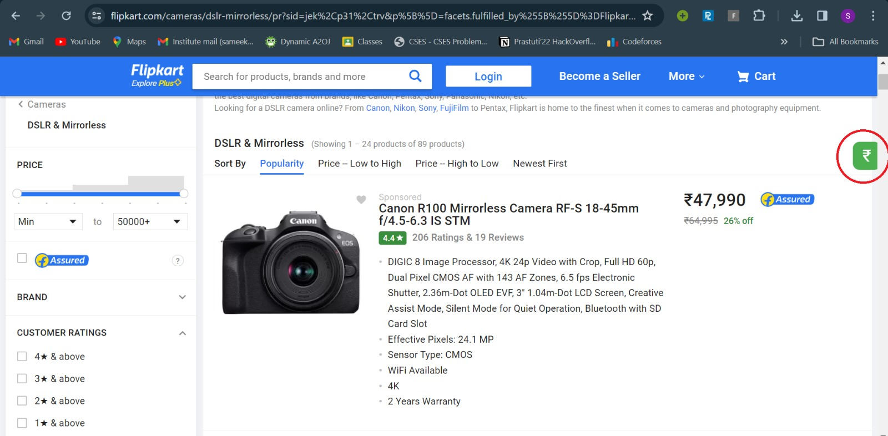
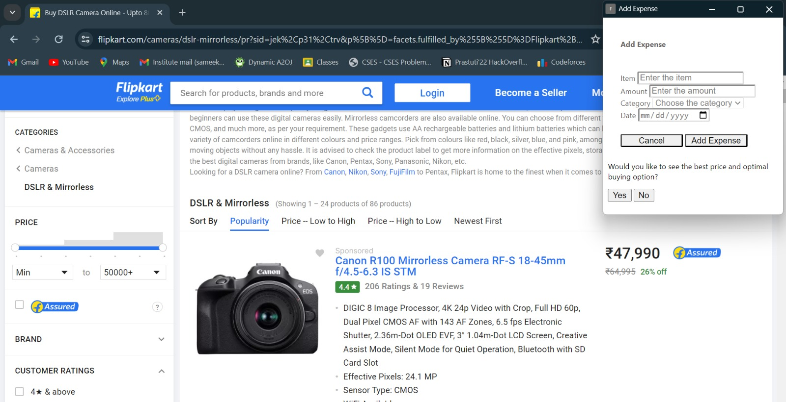
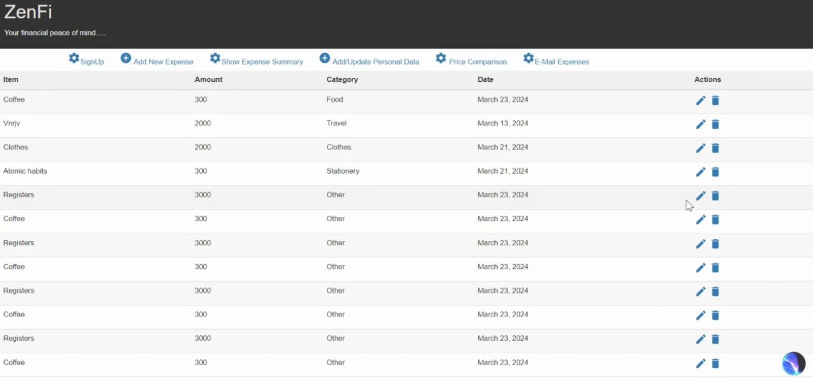
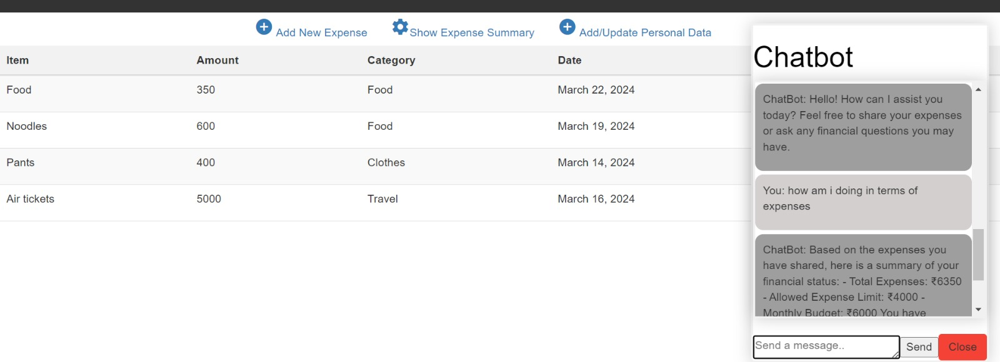

# **Finovate**

This Django based platform provides a Chrome extension for real-time tracking of financial goals, serving as a transaction reminder tool during online purchases. Integrated chatbot offers personalized spending analysis and automatic expense tracking while maintaining user privacy. Users can leverage web scraping for price comparison and optimal purchases, alongside predictive analytics for future expense forecasting, empowering effective budgeting and financial planning.

## Table of Contents

- [Features](#features)
- [Installation](#installation)
- [Usage](#usage)
- [Screenshots](#screenshots)

## Features

- _Real-time Savings Tracking:_

  - Track your savings goals in real-time with our gamified app.
  - Visualize your financial journey and stay motivated to achieve your goals.

- _Transaction Reminder Extension:_

  - The Chrome extension offers a convenient way to effortlessly track your expenses with just one click.
  - Seamlessly integrated into your transaction experience.

- _ChatBot Integration:_

  - Interact with the chatbot for personalized spending analysis and recommendations based on your spending patterns.

- _Option for Optimal Purchases:_

  - Use our feature to compare prices and find the best deals from e-commerce sites like Amazon and Flipkart.

- _Price Prediction:_

  - Predict the best time to buy a product based on the price history of the product.

- _Gmail Integration:_

  - Expenses tracked automatically by analyzing user's Gmail inboxes for E-commerce transaction-related emails.

- _Reviewing Set Targets:_
  - Expense summary allows the user to see how far they are from the set expenditure goal.

## Installation

1. **Clone the repository**

   ```bash
    git clone https://github.com/sameekshamalav/zenfi_desisproject.git

   ```

2. **Installing Python**

   Python is required to run this project. Install Python according to your operating system.

3. **Install some required dependencies**

   ```bash
     pip install lxml

     pip install beautifulsoup4

     pip install openai

     pip install cryptography

     pip install google-generativeai

     pip install -U django-celery-beat

     pip install transformers

     pip install jwt

     pip install pandas

     pip install pymysql

     pip install google-auth

   ```

Also:

     sudo apt-get install php7.2-imap

4. **Add your credentials**

   Add your credentials at the following:

   - **Open desis_project/settings.py** : Add your mySQL workbench credentials in Database setting
   - **Open apis/views.py** : Place your OpenAI API key (If you don't have one, you can get it from [here](https://platform.openai.com/api-keys) ) at api_key in chatbot_view
   - **Open apis/views.py** : Place your API key for gemini connection at api_key in process_emails_with_gemini

5. **Load the extension**

   To load an extension from a local directory into your browser, follow these steps:

   - **Open Extension Management Page:**

     Open the Chrome browser and navigate to `chrome://extensions/`.

   - **Enable Developer Mode:**

     Toggle the "Developer mode" switch at the top right corner.

   - **Load the Extension:**

     Click on the "Load unpacked" button, navigate to the directory where you downloaded the extension files, and select the folder containing the extension.

   - **Confirm Installation:**

     After loading the extension, it should appear in the list of installed extensions. Ensure that it is enabled by toggling the switch next to the extension name.

   - **Test the Extension:**

     Once the extension is installed and enabled, you will be able to see it on pages which are mostly used by users and where they spend. Currently the extension is set to work on only amazon, flipkart, myntra, zomato and swiggy.

6. **Start Django Server**

   ```bash
     py manage.py makemigrations

     py manage.py migrate

     py manage.py runserver
   ```

## Usage

- **Extension**
  The extension appears on certain listed websites on right. The user just has to click it to record his/her transaction. It also asks the user if he wants to see the optimal buying or price history of the product, responding YES to which, the user is directed to the website's page where he can compare and predict the prices.  

- **Price Prediction and Comparison**
  On the price prediction and comparison page, user can enter the product name and the future date where he wants to predict the price. On submitting the user can see the predicted price and also compare prices on some E-commerce platforms like Amazon and Flipkart.  

- **Chatbot as a Financial Adviser**

  The chatbot appears on the main page, opening which chatbot will assist the User with any financial questions or concerns they may have.

- **Gmail Integration**

  At the main page, by Gmail expenses we can get automatically tracked order expenses from the previous day.

## Screenshots







